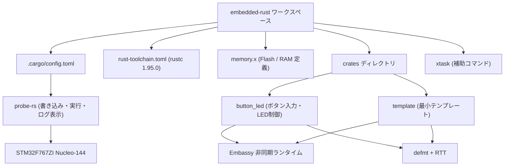
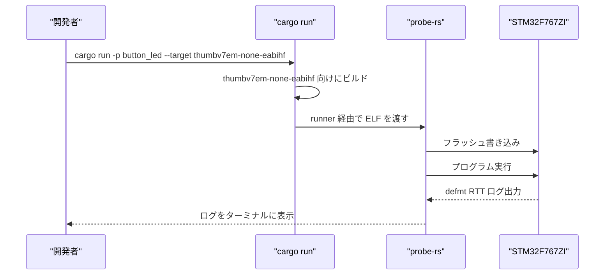

# embedded-rust

STM32F767ZI Nucleo-144 向けの組込み Rust ワークスペースです。

Rust Edition 2024、`rustc 1.95.0`、ターゲット `thumbv7em-none-eabihf` を使用し、
Embassy 非同期フレームワーク、`defmt` + RTT ログ、`probe-rs` によるフラッシュ書き込み、
`xtask` によるホスト/組込みビルド分離を提供します。



---

## ハードウェア要件とメモリレイアウト

| 項目 | 内容 |
|---|---|
| MCU | STM32F767ZI |
| ボード | Nucleo-144 |
| デバッガ | ST-Link (オンボード) |
| ターゲット | `thumbv7em-none-eabihf` |
| 書き込みツール | `probe-rs` |

`memory.x` で定義しているメモリレイアウト:

| 領域 | 属性 | 開始アドレス | サイズ | 用途 |
|---|---|---|---|---|
| `FLASH` | `rx` | `0x08000000` | 1792K | プログラム領域 (Sector 0–10) |
| `USER_FLASH` | `rx` | `0x081C0000` | 256K | 予約領域 (Sector 11) |
| `RAM` | `rwx` | `0x20000000` | 512K | DTCM + SRAM1 + SRAM2 |

---

## セットアップ

`rustup` がインストール済みであることを前提とします。
`rust-toolchain.toml` で Rust `1.95.0` に固定されているため、
初回ビルド時に指定されたツールチェーン・コンポーネント・ターゲットが自動インストールされます。

```sh
rustup show
```

`probe-rs` をインストールし、ボードの接続を確認します。

```sh
cargo install probe-rs-tools
probe-rs list
```

ホストテストや依存チェックに必要なツールもインストールします。

```sh
cargo install cargo-nextest --locked
cargo install cargo-deny --locked
```

---

## ビルドとフラッシュ書き込み

`.cargo/config.toml` に runner が設定済みです。

```toml
runner = "probe-rs run --chip STM32F767ZITx"
```

`.cargo/config.toml` では `defmt` 用の環境変数も設定されています。

```toml
DEFMT_LOG = "info"
DEFMT_RTT_BUFFER_SIZE = "4096"
```

既定では `info` レベル以上のログが RTT 経由で表示されます。
ログレベルを変更する場合は環境変数を上書きしてください。

```sh
# bash
DEFMT_LOG=debug cargo run -p button_led --target thumbv7em-none-eabihf

# PowerShell
$env:DEFMT_LOG="debug"; cargo run -p button_led --target thumbv7em-none-eabihf
```

`cargo run` でビルド → フラッシュ書き込み → 実行 → RTT ログ表示を一括実行できます。

```sh
cargo run -p button_led --target thumbv7em-none-eabihf
```

```sh
cargo run -p template --target thumbv7em-none-eabihf
```



リリースビルドで実行する場合:

```sh
cargo run -p button_led --release --target thumbv7em-none-eabihf
```

ビルドのみ行う場合:

```sh
cargo build -p button_led --target thumbv7em-none-eabihf
```

---

## クレート一覧

| クレート | 種別 | 概要 | ホストテスト |
|---|---|---|---|
| `button_led` | lib + bin | ボタン入力・LED制御サンプル (Embassy) | ○ (`button_fsm` 等) |
| `template` | bin | `new_crate.sh` のベースとなる最小テンプレート | × |
| `xtask` | bin | ホスト向けビルド・テスト補助ツール | - |

---

## よく使うコマンド

| 用途 | コマンド |
|---|---|
| フラッシュ書き込み (button_led) | `cargo run -p button_led --target thumbv7em-none-eabihf` |
| フラッシュ書き込み (template) | `cargo run -p template --target thumbv7em-none-eabihf` |
| ビルドのみ | `cargo build -p button_led --target thumbv7em-none-eabihf` |
| リリースビルド | `cargo build -p button_led --release --target thumbv7em-none-eabihf` |
| フォーマット | `cargo fmt --all` |
| ホスト向けテスト | `cargo xtask test-host` |
| ホスト向け clippy | `cargo xtask clippy-host` |
| 組込み向けビルド | `cargo xtask build-embedded` |
| 組込み向け clippy | `cargo xtask clippy-embedded` |
| CI 全体チェック | `cargo xtask ci` |
| 依存チェック | `cargo deny check` |

---

## xtask サブコマンド

| サブコマンド | 内容 |
|---|---|
| `test-host` | ホスト向けテストを実行 (`cargo-nextest` 使用)。`--with-doctests` で doctest も実行 |
| `clippy-host` | ホストテスト可能なクレートに clippy を実行 |
| `build-embedded` | 組込み向けにビルド (`--exclude xtask`) |
| `clippy-embedded` | 組込み向けに clippy を実行 (`--exclude xtask`) |
| `ci` | fmt check → clippy-host → test-host → clippy-embedded → build-embedded |
| `list-host-packages` | ホストテスト可能なパッケージ一覧を表示 |

---

## 新規クレートの追加

`./scripts/new_crate.sh` で `crates/template/` をベースに新規クレートを生成します。

```sh
./scripts/new_crate.sh <name>
```

自動で行われる処理:

- `crates/<name>/` を作成 (`crates/template/` をコピー)
- `Cargo.toml` の `package.name` と `[[bin]]` 名を `<name>` に変更
- `main.rs` の `info!("template crate started")` を `info!("<name> crate started")` に変更
- `scripts/template.sh` から `scripts/<name>.sh` ランナースクリプトを生成

生成後は `src/main.rs` を編集してアプリケーションを実装し、
`cargo run -p <name> --target thumbv7em-none-eabihf` でフラッシュ書き込みできます。

---

## 既知の問題

`xtask` はホスト向けの `std` バイナリですが、ワークスペースメンバーであるため、
組込みターゲットに対して `cargo clippy --workspace --target thumbv7em-none-eabihf --bins` のように
実行すると `xtask` もベアメタル向けにコンパイルされてエラーになります。

この問題は `xtask` の組込み向けコマンドで `--exclude xtask` を指定することで回避済みです
(`xtask/src/main.rs` に反映済み)。
