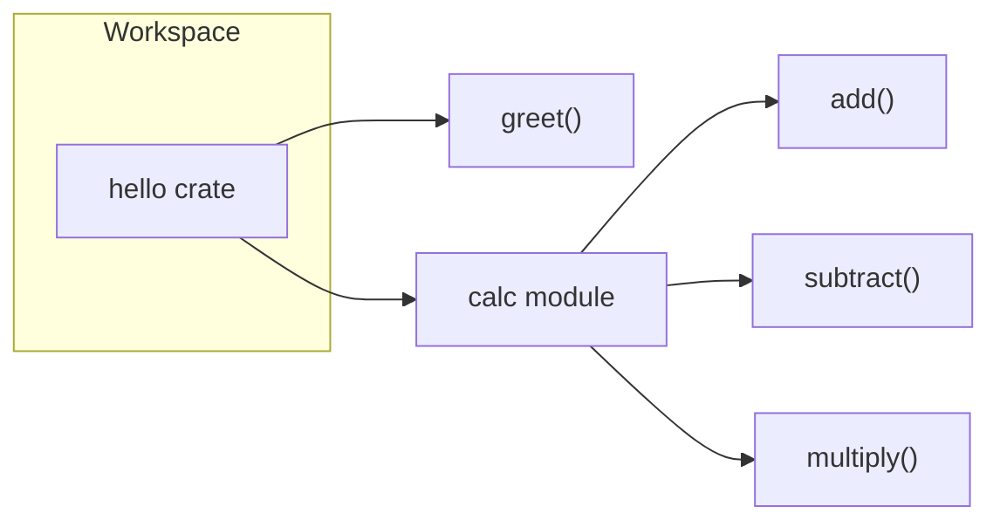
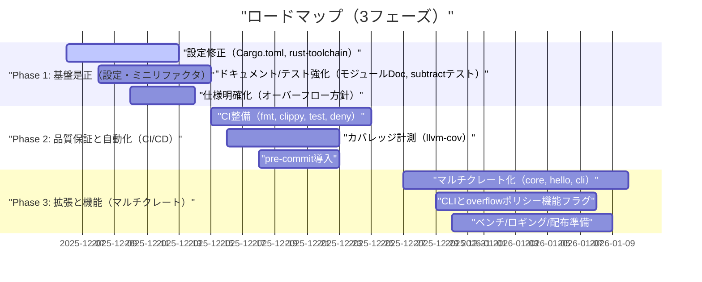

# Rust Workspace Boilerplate — Project Brief 🦀

## 1. プロジェクト概要（What & Why）

- **プロジェクト名**：Rust Workspace Boilerplate
- **タイプ**：マルチメンバーワークスペースのテンプレート（現状は単一クレート）
- **現状構成**：`hello`クレート（挨拶機能と基本算術演算）
- **目的**：
  - スケール可能なRustワークスペースの土台を提供し、複数クレートに拡張しやすい設計を確立する
  - コード品質（読みやすさ・一貫性・正確性・簡潔性）と自動化（CI/CD）を両立する
  - 開発者と利用者双方が安心して使えるAPIドキュメント・テスト・品質保証を整備する

### 現在の構成図



---

## 2. 現状分析（Strengths & Issues）

### ✅ 強み（コードレビュー：shimai分析）

- **コードが極めてクリーン**（美的スコア8/10）
- **Five Pillars評価 4/5**（Clarity/Consistency/Conciseness/Correctnessが高水準）
- **モジュール構成が適切**（再エクスポートによるAPIフラット化）
- **ドキュメントコメントとdoctestが丁寧**（利用者視点の配慮あり）

### ⚠ 課題（コード面）

- **subtract関数のテスト未実装**
- **オーバーフロー挙動の未明記**（仕様不明瞭）
- **calc/mod.rsのモジュールドキュメント不足**
- **greet関数の一時変数が冗長**（簡潔化可能）

### 🛠 設定レビュー（要確認事項）

| 設定項目 | 現状 | 確認事項 | 対応方針 |
|---|---|---|---|
| edition | "2024" | ✅ 最新版（2024年12月時点でリリース済み） | 現状維持でOK |
| resolver | "3" | ⚠️ 要確認（Cargoのresolver仕様を確認） | 公式ドキュメントで有効性を確認し、必要に応じて"2"へ |
| publish | `workspace.package.publish = false` | 継承により意図せぬ非公開化 | ルートの`publish`デフォルトは削除し、各クレートで明示管理 |
| rust-version | "1.93.0" | ✅ 最新版（2024年12月時点でリリース済み） | MSRVとして適切か判断し、チーム環境と調整 |
| cargo-deny | sparse index未対応設定 | crates.ioのsparseモードと整合しない | `cargo-deny`の設定更新（最新仕様に合わせる） |

### 🔧 改善余地（環境・運用）

- **rust-toolchain.toml導入**によるツールチェーン固定
- **CI/CDパイプライン未構築**
- **pre-commitフック未導入**
- **テストカバレッジ80%未達**

---

## 3. 技術スタック（現状と是正）

- **Rust Edition**：**2024**（最新版を使用）
- **依存関係管理**：`workspace.dependencies`を活用
- **品質保証**：`rustfmt`, `clippy`, `cargo-deny`
- **開発ツール**：カスタムCargoエイリアス（例：`cargo ci`, `cargo cov` などを後述で整備）
- **推奨追加**：
  - `cargo-llvm-cov`（テストカバレッジ）
  - `criterion`（ベンチマーク）
  - `tracing`（ロギング/観測性）
  - `thiserror`（わかりやすいエラーモデル）
  - `clap`（CLI実装用）

---

## 4. 改善ロードマップ（3フェーズ構成）

プロジェクトを安全に拡張しながら品質を高めるため、3フェーズで実行。



### Phase 1（基盤是正・1〜2週）

- 設定確認
  - `edition = "2024"`は最新版のため現状維持
  - `resolver = "3"`の有効性を公式ドキュメントで確認し、必要に応じて`"2"`へ修正
  - `rust-version = "1.93.0"`は最新版だがMSRVとして適切かチーム環境と調整
  - `workspace.package.publish`の削除を検討（公開クレートのみ個別設定）
  - `rust-toolchain.toml`でツールチェーン固定（例：`channel = "stable"`）
- コード・ドキュメント是正
  - `calc/mod.rs`に**モジュールドキュメント**を追加
  - **subtract関数のテスト**を追加（ユニット/ドクテスト）
  - **greet関数の冗長な一時変数を削除**（簡潔化）
  - **オーバーフロー挙動を仕様として明文化**（下記Policy参照）

### Phase 2（品質保証・自動化・2〜3週）

- CI/CD（GitHub Actions等）
  - `fmt`/`clippy`/`test`/`doctest`/`cargo-deny`/`cargo-llvm-cov`
  - **ビルドマトリクス**：`stable`と`MSRV`でのビルド/テスト検証
  - **成果物**：カバレッジレポート（LCOV/HTML）をアーティファクト化
- pre-commitフック
  - `fmt`/`clippy --fix`/`test`/`deny`をブロックポイント化
- 目標
  - **テストカバレッジ >= 80%** 到達
  - **lint警告ゼロ**、**denyチェック合格**

### Phase 3（拡張・2〜4週）

- マルチクレート化
  - `core`（算術とポリシーの基盤）、`hello`（ドメインAPI）、`cli`（操作系）
- 機能拡張
  - **overflowポリシー機能フラグ**（checked/wrapping/saturating）
  - **CLI**（`clap`で`greet`/`calc`を提供）
  - **ベンチマーク**（`criterion`）
  - **ロギング/観測性**（`tracing`）
- リリース準備
  - ライセンス・README・CHANGELOG・`cargo-release`スクリプト整備

---

## 5. 追加機能提案（優先度付き）

| 優先度 | 機能 | 説明 | 価値 |
|---|---|---|---|
| 高 | **overflowポリシーの機能フラグ** | `checked`/`wrapping`/`saturating`を選択可能に | 性能/安全のトレードオフを利用者が選択できる |
| 高 | **CLIクレート（clap）** | `hello`の挨拶・算術をCLIから操作 | 導入容易性・デモ/検証を加速 |
| 中 | **ベンチ（criterion）** | `add/subtract`の性能測定 | 回帰検知・最適化の土台 |
| 中 | **観測性（tracing）** | 主要APIにログトレース | デバッグ容易化・運用知見 |
| 中 | **エラーモデル（thiserror）** | わかりやすい`OverflowError`など | API利用時の誤用減少 |
| 低 | **i18n（多言語greet）** | 日本語/英語などの挨拶対応 | ユースケース拡張 |
| 低 | **no_std対応（coreのみ）** | 組込み/Wasmtimeなど向け | ポータビリティ向上 |

---

## 6. 仕様指針：オーバーフロー挙動（Policy）

- デフォルト：**wrapping**（速度優先、`i64::wrapping_add`等）
- 安全志向：**checked**（`try_add/try_sub`で`Result`返却、失敗時に`OverflowError`）
- 安全と性能の中庸：**saturating**（飽和演算）
- 機能フラグ例：
  - `overflow-checked`, `overflow-wrapping`（デフォルト）, `overflow-saturating` のいずれかを選択
  - CIで各フラグのビルド・テストを実行して整合性を担保

---

## 7. 具体的改善例（コードスニペット）

### greet関数の簡潔化（冗長な一時変数を削除）

```rust
/// 挨拶を返す。
/// # Examples
/// ```
/// use hello::greet;
/// assert_eq!(greet("Alice"), "Hello, Alice!");
/// ```
pub fn greet(name: &str) -> String {
    format!("Hello, {name}!")
}
```

### subtract関数のテスト追加（ユニット＋ドクテスト）

```rust
// calc/mod.rs
/// 二数の減算を行う。
/// # Examples
/// ```
/// use hello::calc::subtract;
/// assert_eq!(subtract(5, 2), 3);
/// assert_eq!(subtract(2, 5), -3);
/// ```
pub fn subtract(a: i64, b: i64) -> i64 {
    a - b
}

#[cfg(test)]
mod tests {
    use super::*;

    #[test]
    fn subtract_basic() {
        assert_eq!(subtract(10, 3), 7);
        assert_eq!(subtract(0, 0), 0);
        assert_eq!(subtract(3, 10), -7);
    }
}
```

### オーバーフロー安全API（例：checked系）

```rust
/// 加算（ラップ）— デフォルト（性能優先）
pub fn add(a: i64, b: i64) -> i64 {
    a.wrapping_add(b)
}

/// 安全な加算（オーバーフロー検知）
#[derive(Debug)]
pub struct OverflowError {
    pub a: i64,
    pub b: i64,
}
pub fn try_add(a: i64, b: i64) -> Result<i64, OverflowError> {
    a.checked_add(b).ok_or(OverflowError { a, b })
}
```

---

## 8. CI/CD・開発体験（DX）計画

- rust-toolchain.toml：`channel = "stable"`、`profile = "minimal"`（MSRV検証はCIで実行）
- GitHub Actions（例）
  - ワークフロー：`fmt → clippy → test → doctest → llvm-cov → cargo-deny`
  - マトリクス：`{ os: ubuntu-latest, toolchain: [stable, msrv] }`
  - 成果物：LCOVレポート、HTMLレポート、`cargo-deny`結果
- pre-commit（またはlefthook）
  - フック：`cargo fmt --check`、`cargo clippy -- -D warnings`、`cargo test`、`cargo deny check`
- Cargoエイリアス（例）
  - `ci = "fmt && clippy && test"`
  - `cov = "llvm-cov --summary-only"`
  - `bench = "criterion"`

---

## 9. 品質指標（KPI）と成功基準（Definition of Success）

| 指標 | 目標値 | 測定方法 | DoD（達成条件） |
|---|---|---|---|
| **テストカバレッジ** | Phase2で≥80%、Phase3で≥85% | `cargo-llvm-cov` | レポートが閾値を超過しCIで合格 |
| **Lint警告** | 0 | `cargo clippy -D warnings` | CIで警告ゼロ |
| **フォーマット** | 100%整形済み | `cargo fmt --check` | CIで整形チェック合格 |
| **セキュリティ/ライセンス** | 重大問題ゼロ | `cargo deny` | 重大/高リスクゼロ、ライセンス許容範囲内 |
| **MSRV対応** | 指定MSRVでビルド成功 | CIマトリクス | stable/MSRV両方でTests Pass |
| **ドキュメント品質** | 公開APIにDoc/Doctest完備 | `cargo doc`/Doctest | モジュールDoc/Examples充実 |
| **パフォーマンス安定** | 算術関数のベンチ変動±5%以内 | `criterion` | ベンチ履歴で回帰なし |
| **リリース準備** | README/CHANGELOG/ライセンス整備 | レビュー | `cargo publish --dry-run`成功（公開クレートのみ） |

---

## 10. リスクと緩和策

- 設定修正の影響範囲不明瞭 → 小刻みPRで適用、CIで回帰検知
- overflowポリシーの機能フラグ乱立 → デフォルトを明確化（wrapping）、他は明示opt-in
- MSRVの過度引き上げ → コミュニティ互換性を優先し、保守可能な範囲で設定

---

## 11. 実行チェックリスト（抜粋）

- [ ] `workspace.package.publish`の削除を検討（公開クレートのみ個別設定）
- [ ] `rust-version = "1.93.0"`がMSRVとして適切かチーム環境と調整
- [ ] `cargo-deny`設定のsparse対応・最新化
- [ ] `calc/mod.rs`のモジュールドキュメント追加
- [ ] `subtract`のユニット/ドクテスト追加
- [ ] `greet`の簡潔化
- [ ] pre-commitフック導入
- [ ] カバレッジ80%到達

---

## 12. まとめ（Next Step）

- まずは**Phase 1**で設定と最小限のコード是正を完了し、**仕様の明文化（特にオーバーフロー）**を行います。
- 続いて**Phase 2**で**品質保証の自動化**を整備し、**カバレッジ80%**を達成。
- 最後に**Phase 3**で**マルチクレート化**と**機能拡張（CLI・ポリシーフラグ等）**を実施し、継続的に拡張可能なテンプレートへ進化させます。

このブリーフは、短期の着手優先順位と、長期の拡張方向を同時に示すものです。小さな改善を継続しながら、品質と自動化を積み上げていきましょう。
